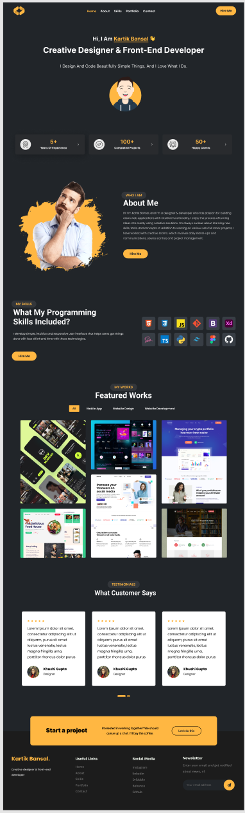

# Підсумкове завдання (залік)

## Верстка сторінки
- створити сторінку відповідно до макета: 
    - посилання на макет у figma: [відкрити макет](https://www.figma.com/file/TXjKzXYSQITd6rO84qnlms/portfolio?node-id=0%3A1) (*рекомендую встановити figma*, тоді буде доступне копіювання зображень та текстів, значення кольорів, розміри тощо. *у браузерній версії доступний тільки перегляд*)
    - використовувати будь-який підхід - `flex`, `grid`, `bootstrap` (можна поєднувати)
- зробити `адаптацію під мобільні` пристрої 
- додати анімацію за допомогою бібліотеки `Animate.css`
    - Animate.css - https://animate.style/
        ```html
        <link rel="stylesheet" href="https://cdnjs.cloudflare.com/ajax/libs/animate.css/4.1.1/animate.min.css" />
        ```
        приклад використання на сторінці
        ```html
        <!-- animate__animated - обов'язково, далі через пробіл назва анімації, наприклад - animate__bounce -->
        <h1 class="animate__animated animate__bounce">An animated element</h1>
        ```
- опублікувати готовий проєкт на GitHub
- оформити звіт (з обов'язковим посиланням на відповідний репозиторій GitHub)
- виконане завдання надіслати на пошту викладачеві

## Demo сторінки     

        