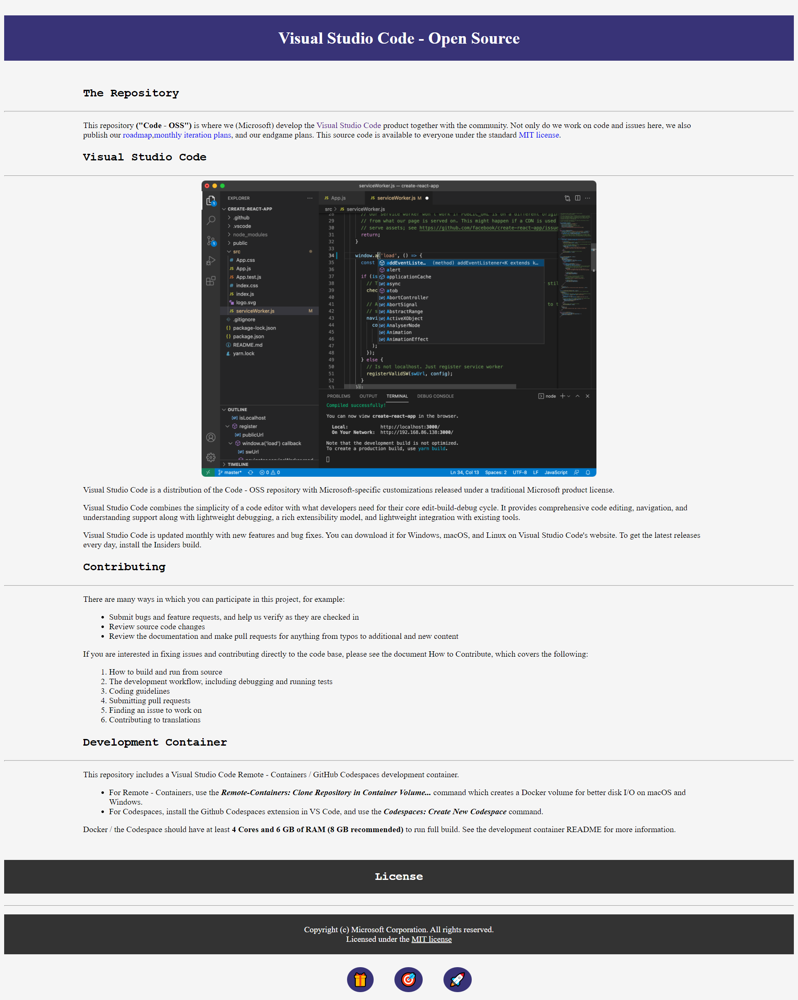
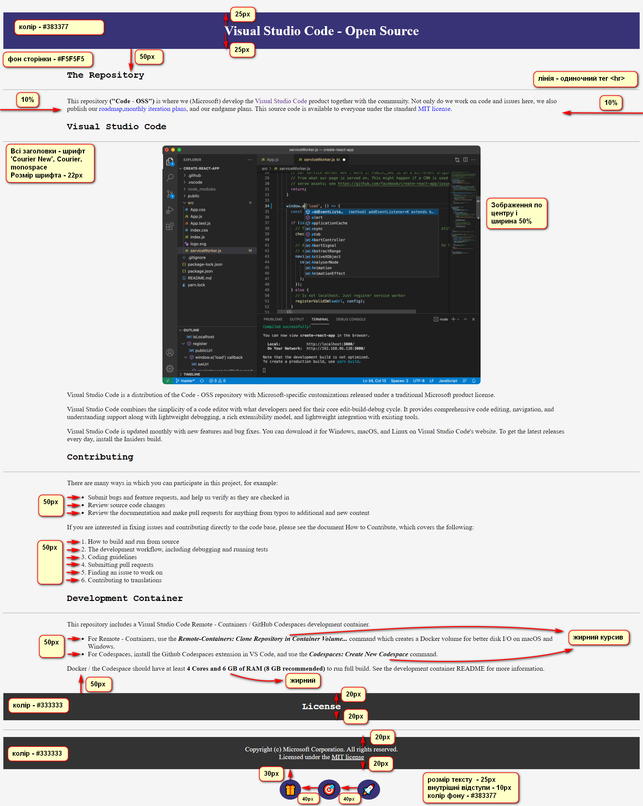

# Лабораторна робота №1
## Створення Web-сторінки за допомогою HTM та CSS 
0. Ознайомитися з [лекційним матеріалом](./materials/) (додано пояснення у вигляді коментарів у файлах [index.html](./materials/index.html) та [style.css](./materials/style.css)). При необхідності, законспектувати. 
1. Створити файли html, css. Розмітити елементи, відповідно до зображення "завдання". У зображенні "значення" вказані параметри, розміри. 
- текст сторінки та картинку копіювати за посиланням: https://github.com/microsoft/vscode
- щоб розмістити смайлики (інформація на всяк випадок, якщо немає досвіду використання) - у коді, в потрібному місці натиснути поєднання клавіш Win+. (віндовс та крапка). 

2. Зареєструватися на гітхабі: https://github.com/ . Створити репозиторій для цієї дисципліни, створити у ній папку для ЛР1 та у неї викласти виконане завдання (два файли - html та css). Якщо будуть складності з цією частиною, то дайте знати, допоможу 
3. Оформити звіт ([зразок тут](https://docs.google.com/document/d/1CFvfYB5FFX3-WBAzTivNe3agYEEcfW1Z/edit?usp=sharing&ouid=104655624940914441082&rtpof=true&sd=true))
4. Надіслати звіт з виконаним завданням на електрону пошту викладачки.

*П.С. якщо виникають питання, то не соромтеся, задавайте їх у діскорд-сервері або телеграмі*

## Завдання (demo): 

## Значення: 
