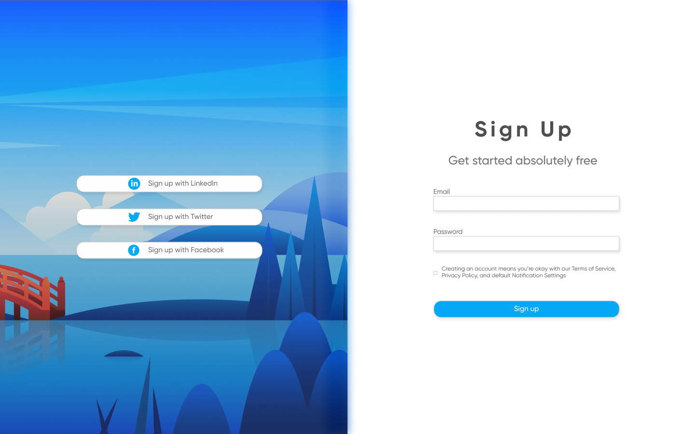
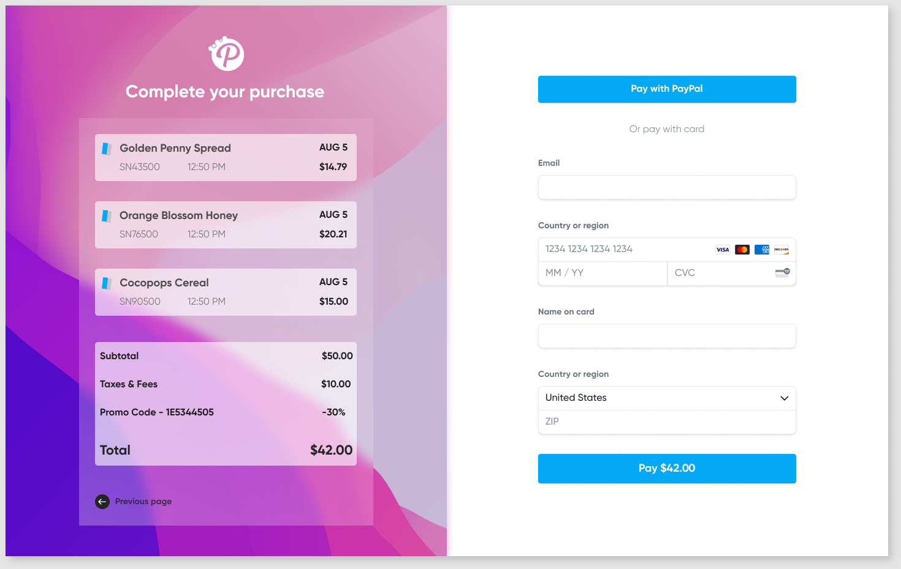

# Лабораторна робота №3
## Форматування Web-сторінки

- створити форму (завдання №1) - зображення для фону та лого знаходяться у [папці з ресурсами assets](./assects/). 
- доповнити [попереднє завдання](../l2/). Додати функціонал, при натиску на кнопку Login, відбувається перехід на сторінку форми поточного завдання №1. 
- створити форму №2. Вказати, що після заповнення форми повинна відкритися сторінка [попереднього завдання](../l2/). 
- колір елементів - #03A9F4 .
- використати шрифт з бібліотеки https://fonts.google.com/ (обрати на свій смак).
- зображення svg вставляти на сторінку через тег `img` чи параметр фону - `background-img`. 

## Завдання №1 (демо)

## Завдання №2 (демо)
