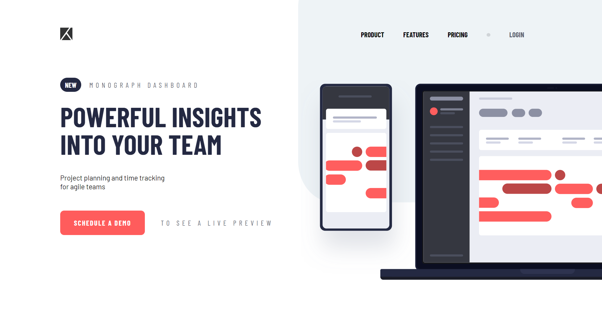

# Лабораторна робота №4
## Верстка Web-сторінки за допомогою flex


- ознайомитися із матеріалом, який [викладено у діскорді (це посилання на відповідне повідомлення)](https://discord.com/channels/941419785114234972/941426123072475146/964055700273786881). Виконати інструкції: 
    - створити html сторінку, де буде розміщено контейнер, в якому 20 дочірніх блоків з нумерацією. (для вашої зручності надаю код emmet - `.container>.item*20{$}` )
    - створити scss файл з розмірами та налаштуваннями створених блоків (код нижче)
    - застосувати параметри flex (і для батьківського, і для дочірніх елементів), оформити декілька прикладів у звіт.
    ```scss
        .container{
        width: 80%;
        height: 80%;
        margin: 0 auto;
        border: 1px solid #000;

        .item{
            width: 100px;
            height: 100px;
            border: 1px solid red;
            text-align: center;
            line-height: 100px;
        }
    }

- створити сторінку, використовуючи flex підхід (для стилів - scss) - зображення знаходяться у [папці з ресурсами images](./images/). 
    - шрифти: 
        - https://fonts.google.com/specimen/Barlow+Condensed (заголовки, меню, кнопки)
        - https://fonts.google.com/specimen/Barlow (весь текст)
    - кольори (використовувати scss змінні):
        - Red - `#FF5C5C`
        - VeryDarkBlue -  `#242942`
        - DarkGrayishBlue - `#5B5F71`
        - GrayishBlue - `#A0A1AC`
        - LightGrayishBlue - `#EEF3F6`
- оформити та надіслати загальний звіт.

## Доповнення до роботи (мобільна адаптація - медіа запити): 
- Обов'язковість використання мета-тегу `viewport` у html https://www.w3schools.com/css/css_rwd_viewport.asp
- Приклад медіа-запитів (мобільної адаптації). Тут же наведено ключові точки розмірів екранів (наприклад, Extra small devices - max-width: 600px) https://www.w3schools.com/css/css_rwd_mediaqueries.asp
    - Додатковий опис точок (з орієнтацією екрану): https://responsivedesign.is/develop/browser-feature-support/media-queries-for-common-device-breakpoints/
    - Додатковий опис точок 2: 
        - 320px — 480px: Mobile devices
        - 481px — 768px: iPads, Tablets
        - 769px — 1024px: Small screens, laptops
        - 1025px — 1200px: Desktops, large screens
        - 1201px and more —  Extra large screens, TV
- Приклад проєкту з медіа-запитом (приклад із заняття) з однією ключовою точкою - [перейти до крод проєкту](./example/)
- **ЗАВДАННЯ**: додати до свого проєкту мобільну адаптацію (розташування елементів - на ваш розсуд та ваш смак). Орієнтовно - меню зліва або по центру, колонки перетворити на рядки, змінити розміри текстів, розмір кнопки. 
    - якщо потрібен чіткий приклад (макет) мобільної адаптації, то дайте знати, будь ласка, у діскорді 🤝

## Завдання (демо)
