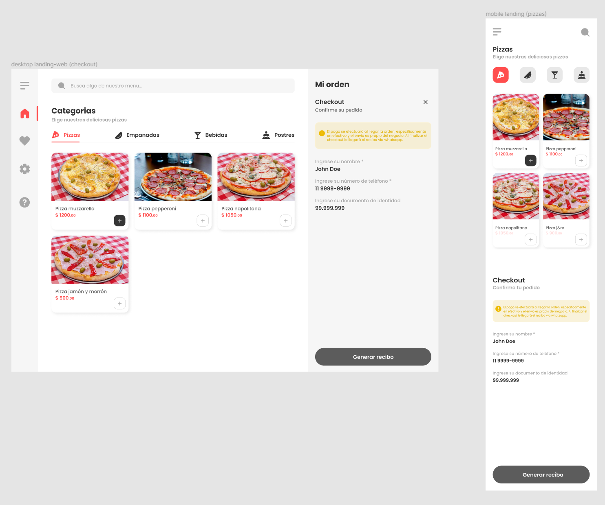

# Лабораторна робота №5
## Верстка Web-сторінки за допомогою grid

- ознайомитися із [матеріалами заняття на тему css grid](./grid/)
- ознайомитися із [матеріалами заняття на тему sass та animation](./sass/)
- створити сторінку за макетом: 
    - посилання на макет у figma: [відкрити макет](https://www.figma.com/file/fE3EC7NOQGeYMVJxxy97ts/Don-remolo-pizza-(Community)-(Copy)?node-id=101%3A1060) (*рекомендую встановити figma*, тоді буде доступне копіювання зображень та текстів, значення кольорів, розміри тощо. *у браузерній версії доступний тільки перегляд*)
    - створити сторінку відповідно до макету використовуючи `grid`
    - зробити `мобільну адаптацію` сторінки (знов ж таки, застосовуючи підхід `grid`)
    - під час верстки застосовувати `scss` (змінні, міксини, наслідування тощо)
    - додати `безперервну анімацію` на сторінці (на ваш розсуд, наприклад, безперервна анімація іконки - поворот на 360 градусів)

## Демонстрація:
