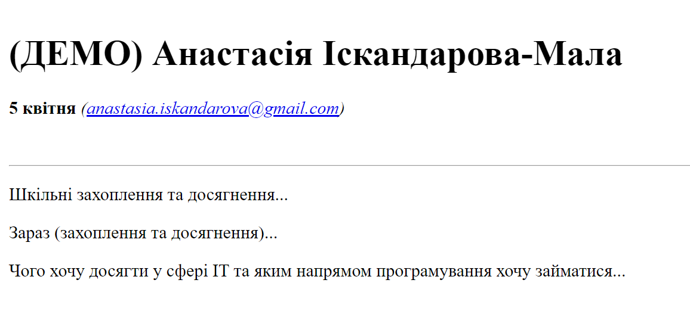
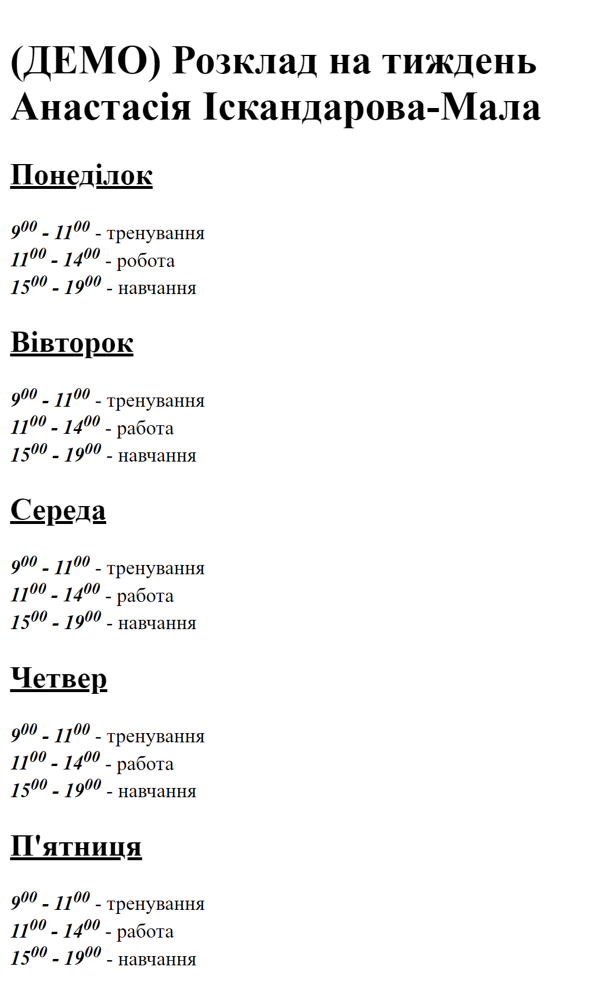

# Самостійна робота №1
## Створення Web-сторінки за допомогою HTML
1. Ознайомитися із матеріалом, який розгядали на парі - [файл з розміткою та коментарями](./index.html)
2. Створити файли html з власними відповідями та розкладом. Розмітити елементи, відповідно до зображеннь "Завдання" (нижче). Файли назвати *index1.html, index2.html*
3. Оформити звіт ([зразок тут](https://docs.google.com/document/d/1IwAhl3XOzQaN0jw43t80GsCydniv2RBr/edit?usp=sharing&ouid=104655624940914441082&rtpof=true&sd=true))
4. Надіслати звіт з виконаним завданням на електрону пошту *anastasia.iskandarova@gmail.com*.

*П.С. якщо виникають питання, то не соромтеся, задавайте їх у діскорд-сервері чи телегам-групі*

## Завдання 1: 

## Значення 2 : 
