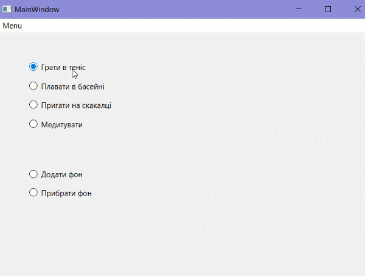

# Завдання ЛР2

1. створити форму з radioButtons ([приклад з лекції, файли додаю](./newform.cpp) + гиф з демонстрацією нижче). Логіка - відповідно до обраного параметру змінювати зображення + фон. Працювати із адресами зображень через Ресурси (проєкт (правою кнопкою миші) - "Добавить новый..." - "Qt" - "Файл ресурсов Qt")
3. на цій же формі зробити меню (наприклад, додати пункт "Завдання" і в ньому підпункт "Завдання 2"). За кліком на підпункт "Завдання 2" відкривати нову форму із завданням, яке було зроблено у попередній [лабораторній роботі](../LR1/)
4. оформити звіт (титул стандартний, назва роботи, опис завдання, код файлів .cpp та скріни працюючого додатку) 
5. звіти надсилати у діскорд 
 
# Приклад з radioButtons

За цим посиланням [приклад, як викликати іншу форму](./main.cpp)

